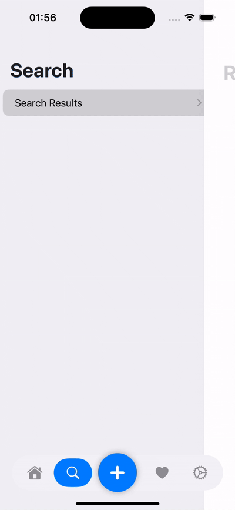

# FloatingTabBar

<p align="left">
<a href="https://www.swift.org"></a>
<a href="https://developer.apple.com/ios/"></a>
<a href="https://developer.apple.com/documentation/SwiftUI"></a>
<a href="https://www.swift.org/package-manager/"></a>
<a href="https://en.wikipedia.org/wiki/MIT_License/"></a>
</p>

A customizable floating SwiftUI tab bar component, designed to work like [`TabView`](https://developer.apple.com/documentation/swiftui/tabview) extension.

<div style="display: flex; justify-content: space-between;">
  
  
  
</div>


## Features

- Customizable floating tab bar with center action button
- Tab animation effects with haptic feedback
- Split tab layout
- Support for translucent backgrounds
- Hide/show tab bar functionality
- Pop to root functionality
- iOS 17.0+ support

## Installation

### Swift Package Manager

Add this package to your project via Swift Package Manager:

```swift
dependencies: [
    .package(url: "https://github.com/gurelyusuf/FloatingTabBar.git", from: "1.0.0")
]
```

## Basic Usage

1. Create an enum that conforms to `FloatingTabProtocol`:

```swift
import FloatingTabBar

public enum ExampleTab: String, CaseIterable, FloatingTabProtocol {
    case home = "Home"
    case search = "Search"
    case favorites = "Favorites"
    case settings = "Settings"
    
    public var symbolImage: String {
        switch self {
        case .home: return "house.fill"
        case .search: return "magnifyingglass"
        case .favorites: return "heart.fill"
        case .settings: return "gear"
        }
    }
}
```

2. Create your tab view:

```swift
import SwiftUI
import FloatingTabBar

public struct ExampleTabBarView: View {
    @State private var activeTab: ExampleTab = .home
    @State private var showCreateSheet: Bool = false
    
    public init() {}
    
    public var body: some View {
        FloatingTabView(configureTabBar(), selection: $activeTab, onCreateTapped: {
            showCreateSheet = true
        }) { tab, _ in
            switch tab {
            case .home:
                HomeTabView()
            case .search:
                SearchTabView()
            case .favorites:
                FavoritesTabView()
            case .settings:
                SettingsTabView()
            }
        }
        .ignoresSafeArea(edges: .bottom)
        .sheet(isPresented: $showCreateSheet) {
            ExampleCreateView(isPresented: $showCreateSheet)
                .presentationDetents([.large])
                .presentationDragIndicator(.visible)
        }
    }
}
```

## Customization

You can customize the tab bar appearance using `FloatingTabConfig`:

```swift
private func configureTabBar() -> FloatingTabConfig {
    var config = FloatingTabConfig()
    config.activeTint = .white
    config.activeBackgroundTint = .accentColor
    config.inactiveTint = .gray
    config.backgroundColor = Color(.systemGray6)
    config.isTranslucent = true
    config.createButtonColor = .accentColor
    config.createButtonSymbol = "plus"
    config.enablePopToRoot = true
    return config
}

// Then use in your FloatingTabView
FloatingTabView(configureTabBar(), selection: $activeTab, onCreateTapped: { ... }) { ... }
```

## Available Customization Options

The `FloatingTabConfig` struct provides the following customization options:

- `activeTint`: The color of the active tab icon
- `activeBackgroundTint`: The background color of the active tab
- `inactiveTint`: The color of inactive tab icons
- `tabAnimation`: The animation used for tab transitions
- `backgroundColor`: The background color of the tab bar
- `insetAmount`: The inset amount for the tab items
- `isTranslucent`: Whether the tab bar has a translucent effect
- `hPadding`: Horizontal padding for the tab bar
- `bPadding`: Bottom padding for the tab bar
- `shadowRadius`: Shadow radius for the tab bar
- `createButtonSize`: Size of the center create button
- `createButtonColor`: Color of the center create button
- `createButtonSymbol`: SF Symbol name for the create button
- `createButtonTint`: Tint color for the create button symbol
- `enablePopToRoot`: Enable pop to root functionality


## Hide/Show Tab Bar

You can hide or show the tab bar using the `hideFloatingTabBar` modifier:

```swift
Text("Some content")
    .hideFloatingTabBar(true) // Hides the tab bar
```

## License

This project is licensed under the MIT License - see the [LICENSE](./LICENSE) file for details.
